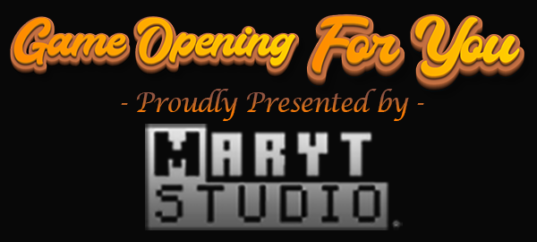

## Game Opening For You


_________________
## Overview

Game-Opening, only for your modpack.

## Features

With this mod, you are able to customize game opening welcome messages for your modpack:

1. Set a time limit for your welcome messages. Any other messages will be blocked, except for the welcome message. The chat box will be kept tidy for you until the end of your preset time period.
2. But don't worry! These messages aren't lost. They're recorded in the log with a special flag `Game Opening For You - Missed Message Collector` like this:
    
    ```
   [21:36:23] [Client thread/INFO] [Game Opening For You - Missed Message Collector]: Missed Message: Some message.
   ```
    
    So you can easily find them if you want to.
3. The program has a few special conditions that it sets up. When a player meets these conditions, the game will send them a special message!
    
    Conditions are listed in configuration file (See also: [Configuration](#configuration)). Currently, we have:
    1. `hardcore_opening`: Whether player has hardcore mode enabled or not.
    2. `night_opening`: Whether current time is later than the daylight end time and earlier than daytime beginning time. These time points are all configurable.
    3. `late_opening`: Whether current time is later than the late night beginning time and earlier than daytime beginning time. This overrides the `night_opening` condition and replaces its message. These time points are all configurable.
    4. `april_fools_day_opening`: Whether current day is April Fool's day.
    5. `halloween_opening`: Whether current day is Halloween.
    6. `spring_festival_opening`: Whether current day is Chinese Spring Festival.

   You can easily remove or comment out any conditions you don't need so they don't trigger.
4. Each condition corresponds to a language entry
    
    ```
   game_opening_for_you.<condition_name>.text
   ```    

   So you can simply modify the `.lang` file to localize the welcome message. We've included a default `en_us.lang` in the mod for you to use as a reference.
   
   Besides, resource loading mods, like [Resource Loader](https://www.curseforge.com/minecraft/mc-mods/resource-loader) or [Open Loader](https://www.curseforge.com/minecraft/mc-mods/open-loader), is recommended.
5. We've made it super easy for you to personalize your welcome message! Just use the placeholders below, which you can write directly in the `.lang` file. The program will take care of the rest, automatically replacing them with your own text.
    ```
   `player` -> Player's Name
    
   `hour`   -> Current time hours
   `min`    -> Current time minutes, will be formatted into 2 digits (8 -> 08 for example)
   `sec`    -> Current time seconds, will be formatted into 2 digits (8 -> 08 for example)
        
   `year`   -> Current date years 
   `month`  -> Current date months, will be formatted into 2 digits (8 -> 08 for example)
   `day`    -> Current date days, will be formatted into 2 digits (8 -> 08 for example)
   
   `br`     -> Break lines, just like press Enter key here 
   ```

## Configuration

Configuration file is fully documented.

Configure it is quick and easy:

```
# Configuration file

general {
    # Display debug logs. For debug purposes.
    B:DEBUG=true

    # The time of day you believe daylight begins during the day, expressed in 24-hour format. The default value is 8:00.
    I:daytimeBeginningHour=8

    # The time of day you believe daylight begins during the day, expressed in 24-hour format. The default value is 8:00.
    I:daytimeBeginningMinute=0

    # The time of day you believe daylight ends during the day, expressed in 24-hour format. The default value is 18:30.
    I:daytimeEndHour=18

    # The time of day you believe daylight ends during the day, expressed in 24-hour format. The default value is 18:30.
    I:daytimeEndMinute=30

    # Each row corresponds to an opening greeting.
    # You can delete the lines you don't need, or comment them out (by adding a # sign in front of them),
    # so that the open screen greeting corresponding to that line will not be sent.
    S:gameOpeningMessageList <
        hardcore_opening
        night_opening
        late_opening
        april_fools_day_opening
        halloween_opening
        spring_festival_opening
     >

    # The duration of the game's opening screen greeting.
    # Chat messages other than game opening greetings during this time will be rejected and saved in the log.
    # You can adjust this value at your discretion,
    # depending on the number of messages you want to block,
    # and the player's experience when sending messages in the game.
    I:gameOpeningMilliseconds=1000

    # Whether to fix day to 2 digits.
    B:hourFixDigits=false

    # The time of day you think late night starts, expressed in 24-hour format. The default value is 23:30.
    I:lateNightBeginningHour=23

    # The time of day you think late night starts, expressed in 24-hour format. The default value is 23:30.
    I:lateNightBeginningMinute=30

    # Whether to fix minute to 2 digits.
    B:minuteFixDigits=true

    # Whether to fix month to 2 digits.
    B:monthFixDigits=false

    # Whether to fix hour to 2 digits.
    B:secondFixDigits=true
}
```

## License

This project's license will be kept the same as its dependency [**dromara/hutool**](https://github.com/dromara/hutool) 's license.

_________________

## Credits

Text art used in project's logo is created with:

**Font Generator** powered by https://www.textstudio.com/

_Dedicated to my sleep-aiding wizard, the beloved ASMR artist_ [**Youtube@LatteASMR**](https://www.youtube.com/watch?v=ZD67afkURFQ&t=104s).
